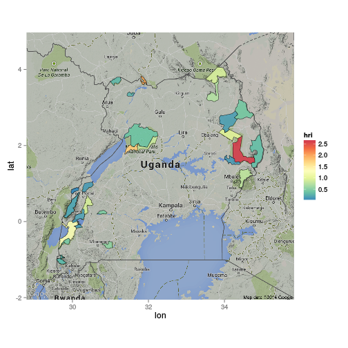

<!--
%\VignetteEngine{knitr::knitr}
%\VignetteIndexEntry{Tutorial for the JRC's eSpecies API}
-->


### Basic information and statistics

DOPA provides an array of information on species and protected area (PA) 
occurrence within the borders (or in some cases the Exclusive Economic Zone 
boundary)  of a given country. `country_list()` can be used to list all the 
countries available in the DOPA database:


```r
library(rdopa)
# We'll also be using package dplyr for data manipulation
library(dplyr)

cl <- country_list()
head(cl)
```

```
##   cid iso2 iso3           name              minx              miny             maxx              maxy
## 1   4   AF  AFG    Afghanistan  60.4784431460001      29.377476867     74.878563529      38.483426111
## 2   8   AL  ALB        Albania  19.2767783890001      39.644562022 21.0572813000001  42.6607506710001
## 3  12   DZ  DZA        Algeria -8.67386722599994  18.9600276950001 11.9795484540001  37.0915184020001
## 4  16   AS  ASM American Samoa    -171.088394165      -14.38247776    -169.41607666 -11.0518255229999
## 5  20   AD  AND        Andorra  1.42387998100008      42.435089111 1.78038597100004      42.658706665
## 6  24   AO  AGO         Angola      11.680835724 -18.0417575839999 24.0821189880001 -4.37932348299994
```

### Species 

There are also few convience function to retrieve species information on 
conuntry-level. To list species included in a particular 
[IUCN status category](http://www.iucnredlist.org/technical-documents/categories-and-criteria)
within a given country, use function `country_species_list()`. For example, if 
you're interested in all (globally) threatened species (i.e. those in IUCN 
categories CR, EN, or VU) that occur in Finland, do the following:


```r
threatened.fin <- country_species_list('Finland', rlstatus=c("CR", "EN", "VU"))
# Select only part of the columns (using dplyr)
select(threatened.fin, iucn_species_id, taxon, class, status, assessed, commonname)
```

```
##   iucn_species_id               taxon          class status   assessed                 commonname
## 1          141446    Anser erythropus           Aves     VU 2008/01/01 Lesser White fronted Goose
## 2          144493       Aquila clanga           Aves     VU 2008/01/01      Greater Spotted Eagle
## 3            2191     Astacus astacus      Crustacea     VU 2010-06-08      Broad clawed Crayfish
## 4          149662    Emberiza aureola           Aves     VU 2008/01/01    Yellow breasted Bunting
## 5           11200         Lamna nasus Chondrichthyes     VU 2006-01-31            Beaumaris shark
## 6          141555 Polysticta stelleri           Aves     VU 2010-08-28            Steller s Eider
## 7           39326   Squalus acanthias Chondrichthyes     VU 2006-01-31                   Blue dog
## 8           39332   Squatina squatina Chondrichthyes     CR 2006-01-31                      Angel
```

Function `country_species_count()` returns the total number of species within
a given country that belong to a specific status categories. For example, to 
get the number of threatened species in Brazil:


```r
country_species_count('Brazil', rlstatus=c("CR", "EN", "VU"))
```

```
## [1] 285
```

This - and breakdown into individual categories - can of course be achieved by
working with the complete country-specific species list:


```r
threatened.bra <- country_species_list('Brazil', rlstatus=c("CR", "EN", "VU"))
# Total number
nrow(threatened.bra)
```

```
## [1] 285
```

```r
# Per category (using dplyr)
threatened.bra %>%
  group_by(status) %>%
  summarise(count = n()) 
```

```
## Source: local data frame [3 x 2]
## 
##   status count
## 1     CR    43
## 2     EN    86
## 3     VU   156
```

### Protected areas

Protected area (PA) statistics are available per country according to 
[IUCN PA categories](http://www.iucn.org/about/work/programmes/gpap_home/gpap_quality/gpap_pacategories/):


```r
country_stats("Sweden")
```

```
##    category area_protected area_protected_perc area_total countryiso   name       iucn_cat
## 1         0          61291               13.69     449211        752 Sweden              0
## 2         1          31764                7.10     449211        752 Sweden             Ib
## 3         2           2482                0.55     449211        752 Sweden             Ia
## 4         3           6874                1.54     449211        752 Sweden             II
## 5         4            267                0.06     449211        752 Sweden            III
## 6         5            809                0.18     449211        752 Sweden             IV
## 7         6           3535                0.79     449211        752 Sweden              V
## 8         7             NA                  NA     449211        752 Sweden             VI
## 9         8           3514                0.79     449211        752 Sweden   Not Reported
## 10        9          12046                2.69     449211        752 Sweden Not Applicable
```

Within a given country, statistics for individual PAs can be retrieved using
`pa_country_stats()`. Let's find out all the PAs within Uganda:


```r
uganda_pa_stats <- pa_country_stats("Uganda")
nrow(uganda_pa_stats)
```

```
## [1] 28
```

So Uganda has 28 individual PAs in the WDPA. The data returned from DOPA 
includes several metrics and a [WKT](https://en.wikipedia.org/wiki/Well-known_text) 
representation of the PA boundaries. In other words, we can also plot the
PAs on a map, but first we must do some conversion using the utility function
`wktdf2sp()`:


```r
# Load spatial libraries
library(ggmap)
library(maptools)

# First, convert the data into a SpatialPolygonsDataFrame
sp_pa_uganda <- wktdf2sp(uganda_pa_stats, wkt.col="wdpa_wkt")

# Let's get a background map using ggmap
map_uganda <- get_map(location=bbox(sp_pa_uganda), zoom=7)
```

```
## Warning: bounding box given to google - spatial extent only approximate.
```

```r
ggmap(map_uganda) + geom_polygon(data = sp_pa_uganda,
                            aes(x = long, 
                                y = lat, group=group), fill="darkgreen",
                            color ="white", alpha = .8, size = .2)
```

 

Now we also create chloropleth maps using the the DOPA data. Let's visualize 
the Habitat Replaceability Index (HRI) which is the ratio between
similar areas outside park and the park itself, that can be used for
characterizing the uniqueness of each protected area. Using `ggmap` and 
`ggplot2` will take some mangling first:


```r
# Fortify the spatial data
data_pa_uganda <- fortify(sp_pa_uganda)
# Combine the fortified data with the actual attribute data. NOTE! This is 
# a bit of a hack as the relation between polygon id and FID is implicit.
data_pa_uganda <- merge(data_pa_uganda, as.data.frame(sp_pa_uganda),
                        by.x="id", by.y="FID")

# Apply some graphical styling too
library(RColorBrewer)
ggmap(map_uganda, darken=0.2) + geom_polygon(data = data_pa_uganda,
                            aes(x = long, y = lat, group=group, fill=hri),
                            color ="black", alpha = .9, size = .2) +
  scale_fill_gradientn(colours = rev(brewer.pal(9, "Spectral")))
```

 
